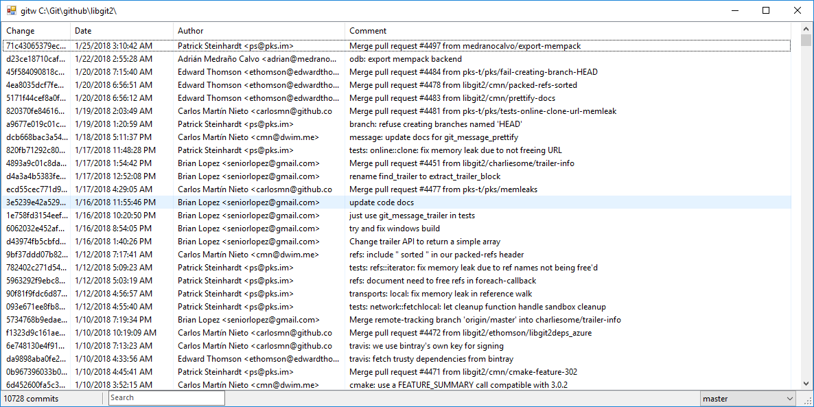

# gitw [](https://ci.appveyor.com/project/wuweidev/gitw)

Gitw is a minimal git GUI client for .NET framework. The features focus on git
log and commit viewing, searching and browsing.



## Build

You need to install Visual Studio Community 2017 to build gitw. The build
output can be found under `main\bin` or `main\bin\x64` for x64 build.

### Using Visual Studio IDE

Open gitw.sln and build the solution.

### Using MSBuild

Open the Visual Studio Developer Command Prompt and go to the project root
folder.
```
msbuild /t:build /p:configuration=release gitw.sln
```

## Install

Copy build output to anywhere you want and add the location to the path.

## Usage

Typical you use gitw together with git on the command line. Whenever you need
to browse the code history or search for some commit, start gitw instead for
more fluid experience. 

By default gitw lists the commits that have made changes under the current
directory (including subdirectories).
Specify a directory path to list the commits for that directory.
```
gitw C:\repo\awesome-project\awesome-feature
```
If the directory path does not exist anymore, make sure to append a backslash
('`\`') after the directory path so that gitw knows it is for a directory.
```
gitw C:\repo\awesome-project\abandoned-feature\
```
You can also specify a file path.
```
gitw C:\repo\awesome-project\awesome-feature\design-notes.md
```

## Credits

Gitw depends on [libgit2sharp](https://github.com/libgit2/libgit2sharp) to
read git repositories.

## License

Gitw is published under the [MIT license](LICENSE).
